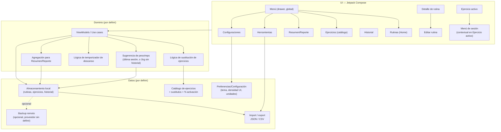
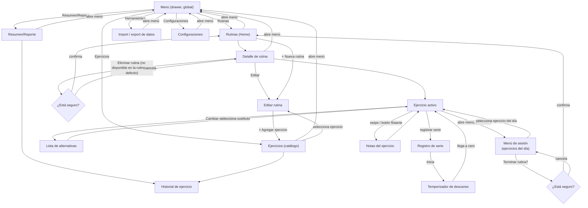

# RepLog — Diagramas

Diagrama de arquitectura y flujo de pantallas. El segundo está pensado como base de storyboard
para bocetar el diseño en Figma: cada pantalla tiene, debajo del diagrama, un boceto burdo en ASCII
de sus elementos clave — no son wireframes finales, son punto de partida para transcribir a Figma.

## Arquitectura

Arquitectura propuesta por capas. Las cajas marcadas "por definir" son decisiones abiertas — ver
[`DESIGN_DOC.md`](DESIGN_DOC.md#preguntas-abiertas); hoy el repo no tiene ninguna de estas capas
implementada, solo el scaffold de Compose.



## Flujo de pantallas

Navegación entre pantallas principales del MVP: un menú hamburguesa (drawer) accesible desde
cualquier pantalla da acceso a las 5 secciones de primer nivel (Rutinas, Ejercicios,
Resumen/Reporte, Herramientas, Configuraciones) — excepto en "Ejercicio activo", donde el menú es
contextual (ejercicios del día en curso + "Terminar rutina?"). Dentro de "Rutinas" vive el flujo de
entrenamiento (Home → Rutina → Ejercicio activo, con edición de rutinas vía "Editar rutina") con
acceso rápido a "cambiar ejercicio", notas y el temporizador de descanso sin perder el contexto del
entrenamiento.



### Bocetos por pantalla (referencia para Figma)

**Menú (drawer)** — el ícono `[≡]` va en la esquina superior izquierda de cada pantalla; el drawer
se abre tocándolo o con gesto (swipe desde el borde izquierdo), desde cualquier pantalla de la app
(en "Ejercicio activo" el mismo ícono/gesto abre en cambio el menú de sesión, ver más abajo)
```
┌──────────────────────────────┐
│  RepLog                      │
├──────────────────────────────┤
│  ● Rutinas                   │
│  ○ Ejercicios                │
│  ○ Resumen/Reporte           │
│  ○ Herramientas              │
│  ○ Configuraciones           │
└──────────────────────────────┘
```

**Rutinas (Home / Lista de rutinas)**
```
┌──────────────────────────────┐
│ [≡]  RepLog                  │
├──────────────────────────────┤
│  Rutinas                     │
│  ┌────────────────────────┐  │
│  │ ★ PPL + Upper/Access.   │  │  <- rutina por defecto
│  │   (rutina_semanal_...)  │  │
│  └────────────────────────┘  │
│  ┌────────────────────────┐  │
│  │ + Nueva rutina          │  │
│  └────────────────────────┘  │
└──────────────────────────────┘
```

**Ejercicios (catálogo)**
```
┌──────────────────────────────┐
│ [≡] < Ejercicios              │
├──────────────────────────────┤
│  🔍 Buscar / filtrar          │
│  • Press banca barra      >  │
│  • Sentadilla              > │
│  • Peso muerto             > │
│  • Dominadas                >│
│  • Caminar en cinta         >│  <- base calentamiento/cardio
│  ...                          │
└──────────────────────────────┘
```

**Resumen/Reporte**
```
┌──────────────────────────────┐
│ [≡] < Resumen                 │
├──────────────────────────────┤
│  Entrenamientos completados:  │
│  12 (este mes)                │
│  Racha actual: 3 semanas      │
│  Volumen total (efectivas):   │
│   Ago: ████████ 8 200 kg      │
│   Jul: ███████  7 600 kg      │
│  [Ver historial por ejercicio]│
└──────────────────────────────┘
```

**Herramientas**
```
┌──────────────────────────────┐
│ [≡] < Herramientas            │
├──────────────────────────────┤
│  [Exportar datos (JSON/CSV)] │
│  [Importar datos]            │
└──────────────────────────────┘
```

**Configuraciones**
```
┌──────────────────────────────┐
│ [≡] < Configuraciones         │
├──────────────────────────────┤
│  Tema           [Claro ▾]    │
│  Tamaño de UI    [Normal ▾]  │
│  Unidades       [Métrico ▾]  │
└──────────────────────────────┘
```

**Detalle de rutina**
```
┌──────────────────────────────┐
│ [≡] < PPL + Upper/Accesorios  │
├──────────────────────────────┤
│  Martes — Push          [✎]  │  <- [✎] Editar rutina
│  1. Press banca barra    >   │
│  2. Press militar         >   │
│  3. Elevaciones laterales >   │
│  ...                          │
│  [Empezar entrenamiento]     │
│                               │
│  [Eliminar rutina]           │  <- oculto/deshabilitado en la
└──────────────────────────────┘     rutina por defecto
```

**Editar rutina**
```
┌──────────────────────────────┐
│ < Editar: PPL + Upper/Access.│
├──────────────────────────────┤
│  Martes — Push       [✎][🗑]  │  <- renombrar / eliminar día
│   ≡ 1. Press banca barra [🗑] │  <- ≡ = arrastrar para mover
│   ≡ 2. Press militar     [🗑] │
│   ≡ 3. Elevaciones lat.  [🗑] │
│   [+ Agregar ejercicio]      │
│                               │
│  [+ Agregar día]             │
│                               │
│  [Eliminar rutina]           │  <- oculto/deshabilitado en la
└──────────────────────────────┘     rutina por defecto
```

**Confirmación (genérica)** — reutilizada para "Terminar rutina?" y "Eliminar rutina"
```
┌──────────────────────────────┐
│  ¿Está seguro?                │
│                               │
│  Se terminará el entrena-     │
│  miento en curso.             │  <- o: "Se eliminará la rutina
│                                    'Nombre' y no se puede
│                                    deshacer."
│  [Cancelar]      [Confirmar] │
└──────────────────────────────┘
```

**Ejercicio activo** (pantalla central del producto)
```
┌──────────────────────────────┐
│ [≡] < Press banca barra [Notas]│  <- [≡] abre el menú de sesión
├──────────────────────────────┤     (contextual, no el global)
│ [Entrenamiento] [Galería]     │  <- 2 tabs; esta es "Entrenamiento"
├──────────────────────────────┤
│  [Pecho] [Barra] [Empuje]     │  <- tags: grupo muscular, equipo,
│                               │     tags libres
│  Calentamiento✓ Aprox▶ Efect.○│  <- fase lineal, no se puede
│                               │     saltear ni retroceder
│      62.5 kg           [✎]    │  <- peso efectivo, editable en
│    (última vez: 60 kg)        │     cualquier momento del flujo
│                               │     (1 kg si no hay historial)
│  [Cambiar ejercicio ▾]        │  <- botón visible siempre
│                               │
│  Serie 2 (aproximación)       │
│  Peso sugerido: 43.7 kg  [✎]  │  <- editable solo mientras esta
│  Reps: [-]  6  [+]            │     etapa está activa; reps
│  [Registrar serie]            │     pre-llenadas con el objetivo
│                               │     de la rutina
│  ⏱ Descanso: 01:23            │  <- temporizador, arranca solo
│                               │     al registrar la serie
│  ● ● ○ ○   (series efectivas) │
└──────────────────────────────┘
```

**Ejercicio activo — tab "Galería" (vacía)**
```
┌──────────────────────────────┐
│ [≡] < Press banca barra [Notas]│
├──────────────────────────────┤
│ [Entrenamiento] [Galería]     │  <- tab activa
├──────────────────────────────┤
│                               │
│     Todavía no hay fotos ni   │
│     videos de este ejercicio. │
│                               │
│     [+ Agregar foto/video]    │
│                               │
└──────────────────────────────┘
```

**Menú de sesión** (contextual, reemplaza al menú global dentro de "Ejercicio activo")
```
┌──────────────────────────────┐
│  Martes — Push                │
├──────────────────────────────┤
│  ✓ Press banca barra          │  <- hecho
│  ▶ Press militar    (actual)  │  <- ejercicio activo
│  ○ Elevaciones laterales      │  <- pendiente; tocar salta acá
│  ...                          │     sin perder progreso
├──────────────────────────────┤
│  ⏻ Terminar rutina?           │  <- pide confirmación
└──────────────────────────────┘
```

**Lista de alternativas (swap)**
```
┌──────────────────────────────┐
│  Alternativas a "Press banca  │
│  con barra"              [X] │
├──────────────────────────────┤
│  • Press banca mancuerna  >  │
│  • Press en máquina       >  │
│  • Flexiones lastradas    >  │
└──────────────────────────────┘
```

**Notas del ejercicio** (acceso sin perder contexto)
```
┌──────────────────────────────┐
│  Notas — Press banca  [Cerrar]│
├──────────────────────────────┤
│  "Ajustar asiento a nivel de  │
│   la barbilla"                │
│                               │
│  [+ Agregar nota]             │
└──────────────────────────────┘
```

**Historial de ejercicio**
```
┌──────────────────────────────┐
│ < Historial — Press banca    │
├──────────────────────────────┤
│  Peso máx: 65 kg               │
│  Volumen (series efectivas):   │
│   Ago 24: ████████ 780 kg      │
│   Ago 21: ███████  720 kg      │
│   Ago 17: ██████   680 kg      │
└──────────────────────────────┘
```
